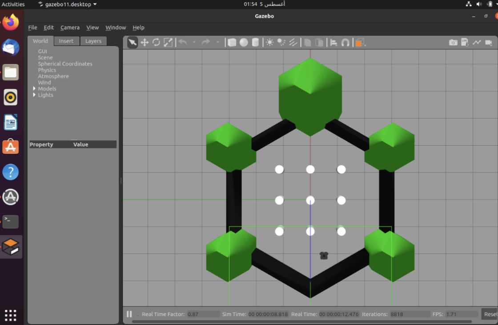
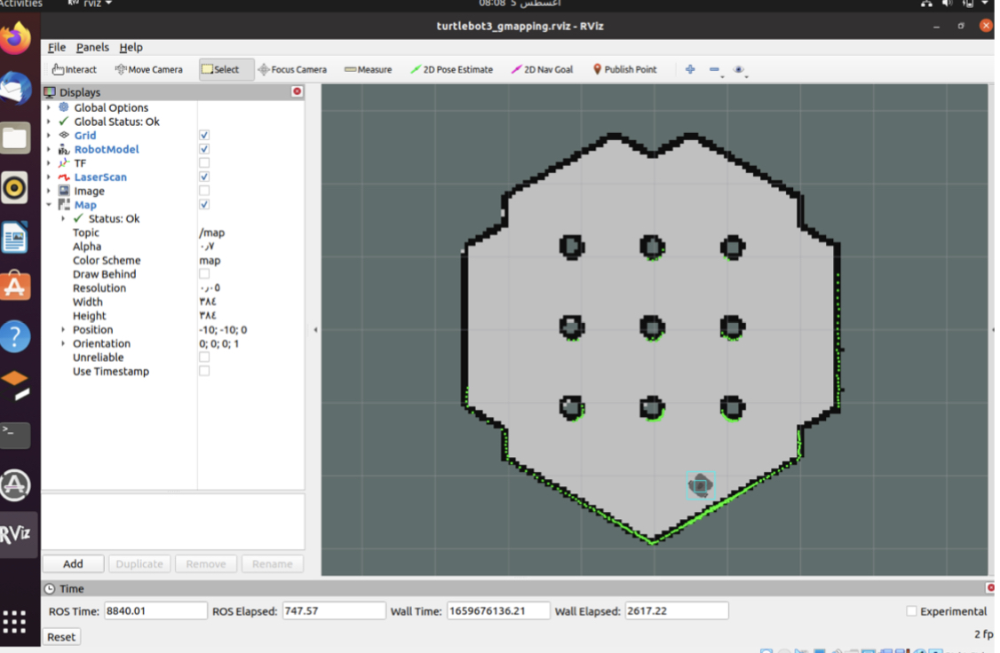
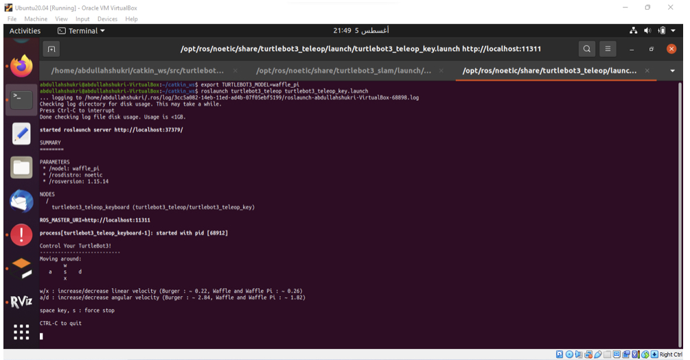
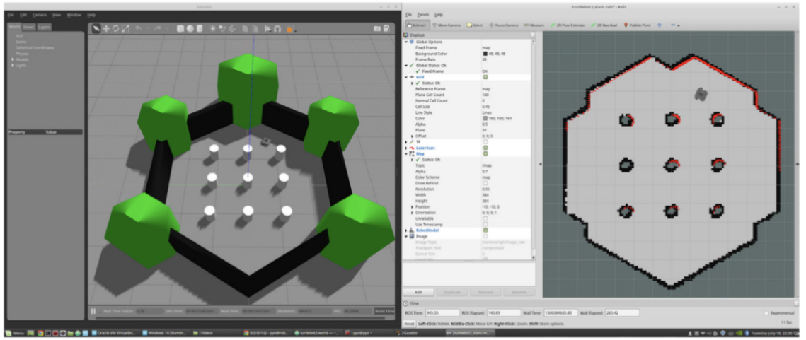

# Use Turtlebot3 with SLAM approach to create and save a map

## 1-Download-and-Install-Ubuntu-on-PC:
### 1.1 Download the proper `Ubuntu 20.04 LTS Desktop` image for your PC from the links below.
* [Ubuntu 20.04 LTS Desktop image (64-bit)](https://releases.ubuntu.com/20.04/)
### 1.2 Follow the instruction below to install Ubuntu on PC:
* [Install Ubuntu desktop](https://ubuntu.com/tutorials/install-ubuntu-desktop#1-overview)
  

## 2-Install-ROS-on-Remote-PC:
Open the terminal with `Ctrl` + `Alt` + `T` and enter below commands one at a time. 
In order to check the details of the easy installation script. 
`$ sudo apt update`  
`$ sudo apt upgrade`  
`$ wget https://raw.githubusercontent.com/ROBOTIS-GIT/robotis_tools/master/install_ros_noetic.sh`  
`$ chmod 755 ./install_ros_noetic.sh` 
`$ bash ./install_ros_noetic.sh` 
 

## 3-Install-Dependent-ROS-Packages:
`$ sudo apt-get install ros-noetic-joy ros-noetic-teleop-twist-joy \` 
  `ros-noetic-teleop-twist-keyboard ros-noetic-laser-proc \` 
  `ros-noetic-rgbd-launch ros-noetic-rosserial-arduino \` 
  `ros-noetic-rosserial-python ros-noetic-rosserial-client \` 
  `ros-noetic-rosserial-msgs ros-noetic-amcl ros-noetic-map-server \` 
  `ros-noetic-move-base ros-noetic-urdf ros-noetic-xacro \` 
  `ros-noetic-compressed-image-transport ros-noetic-rqt* ros-noetic-rviz \` 
  `ros-noetic-gmapping ros-noetic-navigation ros-noetic-interactive-marker` 
   

## 4-Install-TurtleBot3-Packages:
Install TurtleBot3 via Debian Packages. 
`$ sudo apt install ros-noetic-dynamixel-sdk` 
`$ sudo apt install ros-noetic-turtlebot3-msgs` 
`$ sudo apt install ros-noetic-turtlebot3` 
 

## 5-Gazebo-Simulation:
### 5.1 Install Simulation Package:
The <b>TurtleBot3 Simulation Package</b> requires `turtlebot3` and `turtlebot3_msgs` packages as prerequisite. Without these prerequisite packages, the Simulation cannot be launched. 
Please follow the [PC Setup](https://emanual.robotis.com/docs/en/platform/turtlebot3/quick-start/) instructions if you did not install required packages and dependent packages 

`$ cd ~/catkin_ws/src/`  
`$ git clone -b noetic-devel https://github.com/ROBOTIS-GIT/turtlebot3_simulations.git` 
`$ cd ~/catkin_ws && catkin_make` 

### 5.2 Launch Simulation World:
Three simulation environments are prepared for TurtleBot3. Please select one of these environments to launch Gazebo.

<b>`Please make sure to completely terminate other Simulation world before launching a new world.`</b>  
<b> TurtleBot3 World </b>  

`$ export TURTLEBOT3_MODEL=waffle` 
`$ roslaunch turtlebot3_gazebo turtlebot3_world.launch` 
 

## 6-SLAM-Simulation:
### 6.1 Run SLAM Node:
Open a new terminal from Remote PC with `Ctrl` + `Alt` + `T` and run the SLAM node. Gmapping SLAM method is used by default. 
Please use the proper keyword among `burger` , `waffle` , `waffle_pi` for the TURTLEBOT3_MODEL parameter. 

`$ export TURTLEBOT3_MODEL=burger` 
`$ roslaunch turtlebot3_slam turtlebot3_slam.launch slam_methods:=gmapping` 
 

### 6.2 Run Teleoperation Node:
Open a new terminal from Remote PC with `Ctrl` + `Alt` + `T` and run the teleoperation node from the Remote PC.  
Please use the proper keyword among `burger` , `waffle` , `waffle_pi` for the TURTLEBOT3_MODEL parameter. 

`$ export TURTLEBOT3_MODEL=burger` 
`$ roslaunch turtlebot3_teleop turtlebot3_teleop_key.launch` 
 

### 6.3 Save Map:
When the map is created successfully, open a new terminal from Remote PC with `Ctrl` + `Alt` + `T` and save the map.  
 

`$ rosrun map_server map_saver -f ~/map`  
 

## 7-Testing:

